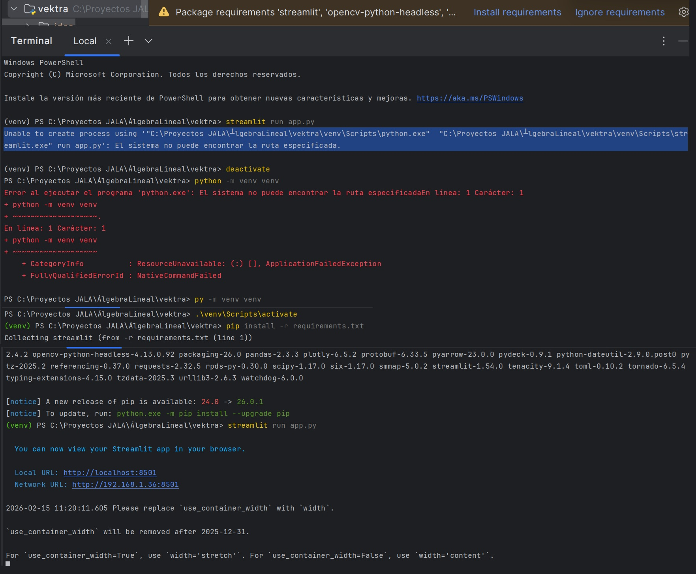

# Vektra: 3D Generation Engine 🚀


**Vektra** es un motor de generación de mallas 3D que transforma datos abstractos (comandos, funciones matemáticas e imágenes) en objetos tridimensionales interactivos.

---

## 🛠️ Tecnologías Core
* **Procesamiento:** `NumPy` & `SciPy` (Cálculo vectorial y Triangulación).
* **Visión Artificial:** `OpenCV` (Detección de contornos mediante Canny).
* **Visualización:** `Plotly` (Renderizado interactivo `Mesh3D`).

---

## ⚙️ Guía de Instalación Quick-Start

1. **Clonar y configurar:**
   ```bash
   git clone [https://github.com/tu-usuario/vektra.git](https://github.com/tu-usuario/vektra.git)
   cd vektra
   python -m venv venv
   source venv/bin/activate  # Windows: source venv/Scripts/activate

2. **Instalar dependencias:**
   ```bash
   pip install numpy opencv-python plotly scipy



--- 

## 📖 Guía de Uso

1. **Generación Paramétrica (Fórmulas)**
   
El motor evalúa funciones f(u, v) en tiempo real.

Ejemplo: La "Silla de Montar" se genera procesando la función z = u^2 - v^2 mediante el módulo *parametric.py*.

2. **Extrusión desde Imagen**

Transforma una fotografía en un sólido 3D detectando sus bordes exteriores. El pipeline sigue este orden:

1. Lectura de imagen (ej: image_f258a0.jpg).
2. Conversión a escala de grises y desenfoque Gaussiano.
3. Detección de bordes con Canny.
4. Generación de malla 3D mediante extrusión de los puntos detectados.

3. **Funciones Sonoras (Síntesis de Fourier)**

Visualiza la construcción procedural de señales de audio complejas mediante la superposición armónica de ondas sinusoidales.
Permite evaluar interactivamente el impacto del número de armónicos (N) en el modelado geométrico y topológico de 6 ondas del catálogo clásico:

1. **Onda Cuadrada:** Sumatoria estándar de armónicos impares
2. **Onda Diente de Sierra:** Progresión lineal armónica.
3. **Onda Triangular:** Atenuación cuadrática con signos alternados.
4. **Tren de Pulsos:** Modulación simétrica de alta frecuencia.
5. **Sierra Asimétrica:** Modulación progresiva impar.
6. **Pulso Cuadrático:** Sumatoria compleja con decaimiento cuadrático exponencial.

---

## 🖼️ Evidencia de Ejecución ##

**📈 Modo Fórmula y Paramétrico**

Muestra de superficies complejas generadas mediante el sistema:

* **Superficies:** Botella de Klein, Helicoides, Sillas de montar.
* **Render:** Totalmente interactivo en el navegador.

**🎵 Modo Funciones Sonoras**

Generación de espectros tridimensionales y curvas analíticas 2D acopladas a ecuaciones matemáticas dinámicas en LaTeX.

### *[!TIP]* ###
Si el modelo 3D aparece invertido o con inconsistencias en las caras, revisa la función *sort_contour_points* en *extrusion.py* o el orden de puntos en *contours.py*.

---

## 🤝 Flujo de Contribución ##
Seguimos una metodología estricta basada en tickets para mantener la trazabilidad:
* **Localizar Ticket:** Identificar el ID (ej. VEK-009).
* **Crear Rama:**
   ```bash
   git checkout -b feat/VEK-009-descripcion-corta

* **Commit Standard:**
   ```bash
   "feat: descripción del cambio (VEK-009)"

---

## 📂 Estructura del Proyecto ##
* **/modules/geometry:** Contiene las capas core de modelado matemático (primitives.py, parametric.py, extrusion.py y fourier.py).
* **/modules/vision:** Procesamiento digital de imágenes y extracción de contornos (image_processing.py, contours.py).
* **/ui:** Vistas modulares de la interfaz de usuario en Streamlit (tab_*.py).
* **app.py:** Punto de entrada principal del layout general de la aplicación.
* **requirements.txt:** Archivo de especificación de dependencias del entorno.